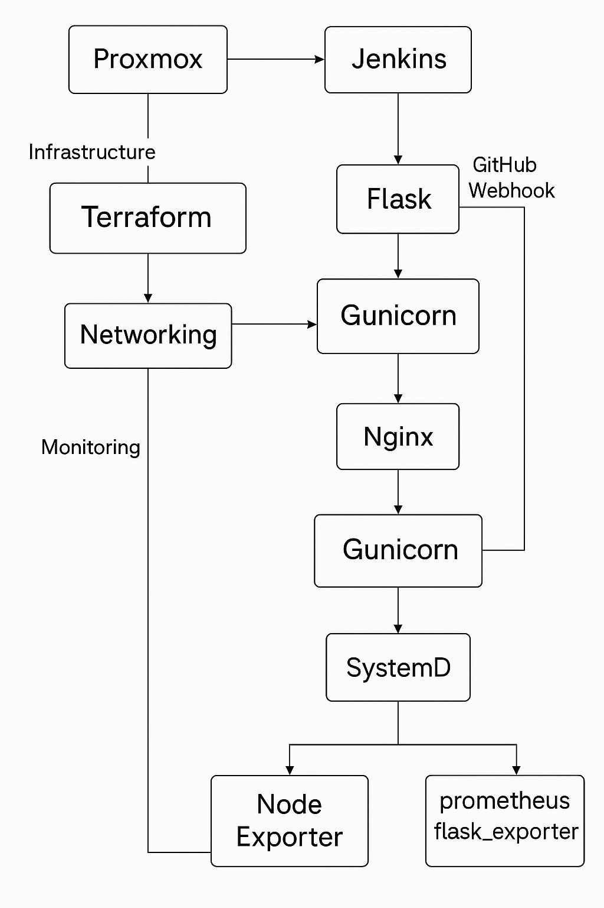

# DevOps_Internship_Challenge #

## Project Overview
This project demonstrates a full DevOps pipeline utilizing **Proxmox, Terraform, Jenkins, Flask, Prometheus, and automation**. The goal is to create an automated and monitored infrastructure with a simple Flask application, automated CI/CD, and monitoring.



## **1. Proxmox Setup**

### **Provision Infrastructure**
- **Manually:**
  - Create **1 VM (Ubuntu 22.04)** and **1 Container (LXC or Docker)**
  - Use a **virtual bridge** for networking and assign **static IPs**
- **Using Terraform (Bonus)**:
  - Configuration stored in `terraform/` directory
  - Example `main.tf` for Proxmox VM:
    ```hcl
    provider "proxmox" {
      pm_api_url = "https://your-proxmox-ip:8006/api2/json"
      pm_user    = "root@pam"
      pm_password = "your-password"
      pm_tls_insecure = true
    }

    resource "proxmox_vm_qemu" "ubuntu_vm" {
      name        = "ubuntu22"
      target_node = "pve"
      clone       = "ubuntu-template"
      cores       = 2
      memory      = 4096
      network {
        model  = "virtio"
        bridge = "vmbr0"
      }
    }


## **2. Networking Setup**
- Configure **static IPs** for VM and container
- Ensure **outbound internet access**
- Enable **hostname resolution** (Bonus)
- **Example Netplan configuration (`/etc/netplan/00-installer-config.yaml`)**:

  ```yaml
  network:
    ethernets:
      ens18:
        dhcp4: no
        addresses:
          - 192.168.1.100/24
        gateway4: 192.168.1.1
        nameservers:
          addresses:
            - 8.8.8.8
            - 8.8.4.4
    version: 2


## **3. Flask Application**
### **Basic Flask App**
- **Endpoints:**
  - `/` → returns `Hello World from [Your Name]`
  - `/compute` → CPU-intensive task (Fibonacci calculation)
- **Directory Structure:**
  ```plaintext
  flask_app/
  ├── app.py
  ├── requirements.txt
  ├── wsgi.py
  ├── systemd/
  │   ├── flask_app.service
  ```
- **Run with Gunicorn + Nginx**
  ```bash
  gunicorn -w 4 -b 0.0.0.0:5000 app:app
  ```
- **SystemD Service (`/etc/systemd/system/flask_app.service`)**
  ```ini
  [Unit]
  Description=Flask App
  After=network.target
  
  [Service]
  User=root
  WorkingDirectory=/path/to/flask_app
  ExecStart=/usr/bin/gunicorn -w 4 -b 0.0.0.0:5000 app:app
  Restart=always
  
  [Install]
  WantedBy=multi-user.target
 

## **4. Automation with Crontab**
- Automate hitting `/compute` every minute:
  ```bash
  crontab -e
  ```
  Add:
  ```plaintext
   curl http://localhost:5000/compute
    ```

## **5. CI/CD with Jenkins**
- **Install Jenkins:**
  ```bash
  sudo apt update
  sudo apt install openjdk-11-jdk -y
  sudo apt install jenkins -y
  ```
- **Jenkins Pipeline (`Jenkinsfile`)**
  ```groovy
  pipeline {
      agent any
      stages {
          stage('Clone Repo') {
              steps {
                  git 'https://github.com/your-repo/flask_app.git'
              }
          }
          stage('Setup') {
              steps {
                  sh 'pip install -r requirements.txt'
              }
          }
          stage('Restart Service') {
              steps {
                  sh 'sudo systemctl restart flask_app'
              }
          }
          stage('Test') {
              steps {
                  sh 'curl http://localhost:5000/'
              }
          }
      }
  }
  ```

## **6. Monitoring with Prometheus**
- Install Prometheus & Node Exporter:
  ```bash
  sudo apt install prometheus prometheus-node-exporter -y
  ```
- **Flask App Monitoring:**
  ```bash
  pip install prometheus_flask_exporter
  ```
  Modify `app.py`:
  ```python
  from prometheus_flask_exporter import PrometheusMetrics
  metrics = PrometheusMetrics(app)
  ```
  Restart Flask app:
  ```bash
  sudo systemctl restart flask_app

## **7. Documentation & Deliverables**
### **GitHub Repository Structure:**
```plaintext
repo/
├── README.md
├── flask_app/
├── terraform/
├── jenkins/
├── monitoring/
├── crontab/
```


## **📌 Conclusion**
This project demonstrates a complete DevOps pipeline covering infrastructure provisioning, application deployment, automation, CI/CD, and monitoring. 🚀


